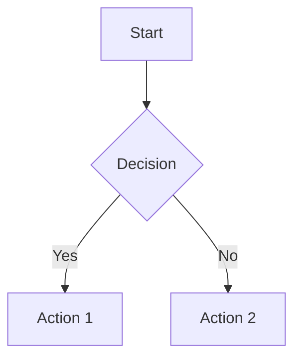
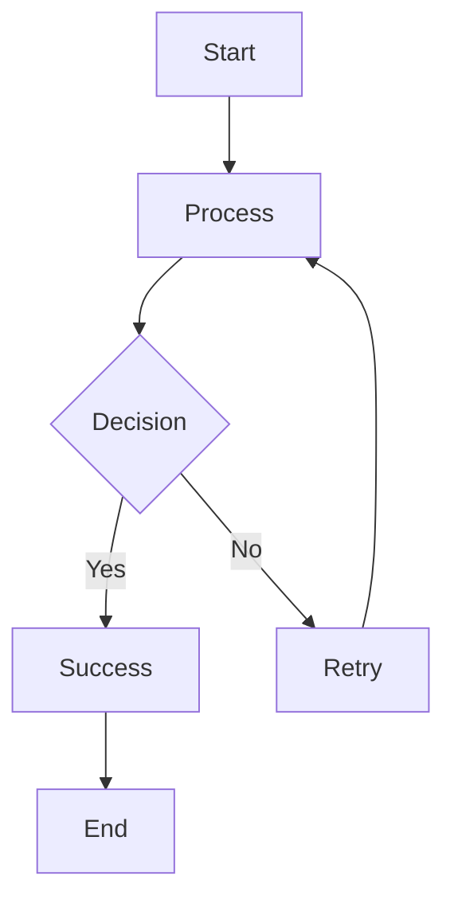
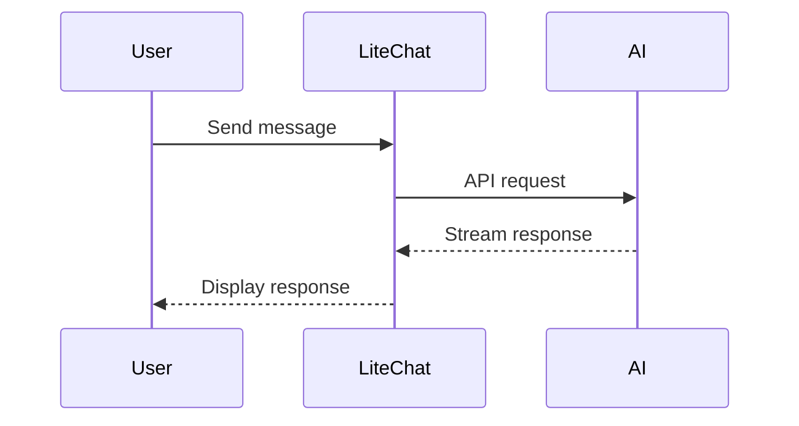
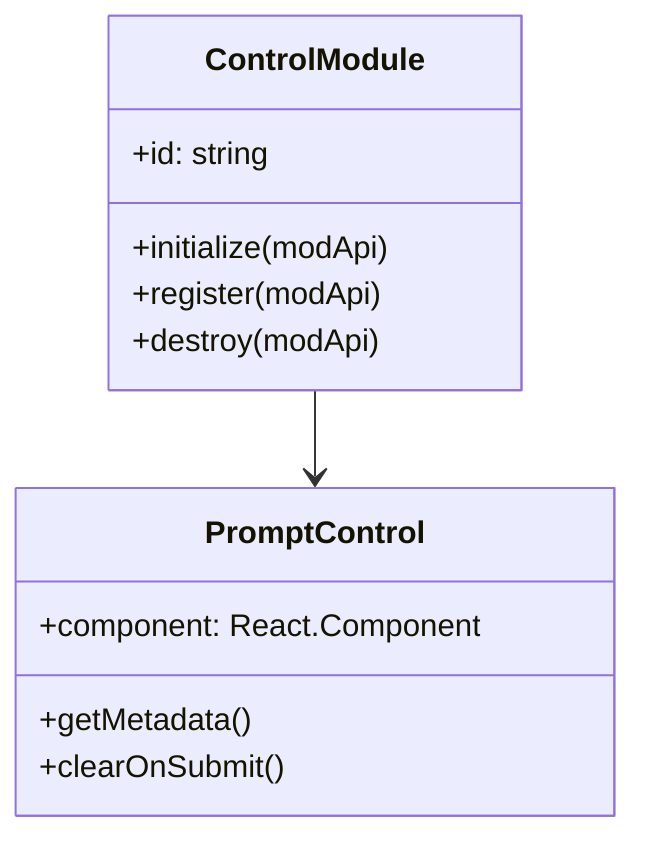
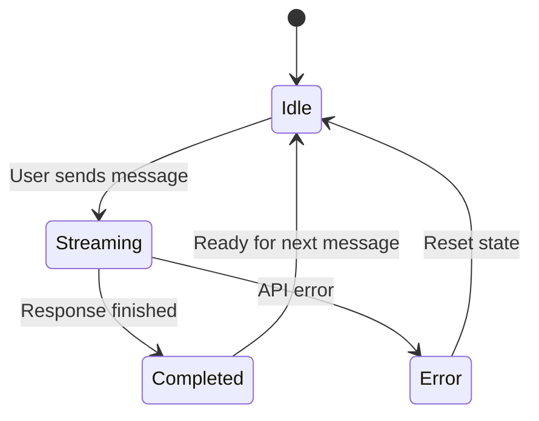
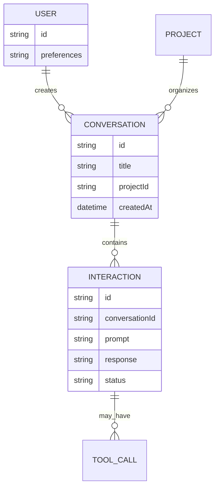

# Canvas Features

The LiteChat canvas provides advanced features for code display, file management, diagram rendering, and interaction controls. These features enhance the developer experience and provide practical tools for working with AI-generated content.

## Code Block Enhancements

### Filepath Support

LiteChat supports specifying filepaths in code blocks using the `language:filepath` syntax, enabling better organization and providing download functionality.

#### Syntax

```markdown
```language:path/to/file.ext
// Your code here
```
```

#### Examples

**TypeScript Component**
````markdown
```tsx:src/components/MyComponent.tsx
import React from 'react';

interface Props {
  title: string;
}

export const MyComponent: React.FC<Props> = ({ title }) => {
  return <h1>{title}</h1>;
};
```
````

**Python Script**
````markdown
```python:scripts/data_processor.py
import pandas as pd
import numpy as np

def process_data(df):
    """Process the input dataframe"""
    return df.dropna().reset_index(drop=True)

if __name__ == "__main__":
    data = pd.read_csv("input.csv")
    result = process_data(data)
    result.to_csv("output.csv", index=False)
```
````

**Configuration File**
````markdown
```yaml:config/app.yaml
app:
  name: "LiteChat"
  version: "1.0.0"
  debug: false

database:
  host: "localhost"
  port: 5432
  name: "litechat_db"
```
````

#### Visual Features

- **Filepath Display**: Shows in the code block header next to language indicator
- **Download Button**: Automatic download functionality for individual files
- **Smart Filenames**: Uses basename from filepath for downloads
- **Fallback Naming**: Generates appropriate filenames based on language when no filepath specified

### ZIP Download Control

The ZIP Download Control automatically detects code blocks with filepaths and provides bulk download functionality.

#### Features

- **Automatic Detection**: Scans assistant responses for code blocks with filepaths
- **Directory Structure**: Preserves the directory hierarchy specified in filepaths
- **Duplicate Handling**: Resolves filename conflicts with automatic counters
- **Progress Feedback**: Toast notifications for success/error states

#### Usage

1. AI provides response with multiple code files using filepath syntax
2. ZIP download button appears in interaction header
3. Click to download all files as organized ZIP archive
4. Files maintain their directory structure and names

#### Implementation

```typescript
// Code blocks are parsed and filtered for filepaths
const codeBlocksWithFilepaths = useMemo(() => {
  const blocks = [];
  parsedContent.forEach((item) => {
    if (typeof item === "object" && item.type === "code") {
      const codeData = item as CodeBlockData;
      if (codeData.filepath && codeData.filepath.trim()) {
        blocks.push({
          filepath: codeData.filepath,
          code: codeData.code,
          lang: codeData.lang,
        });
      }
    }
  });
  return blocks;
}, [parsedContent]);

// ZIP generation with directory structure
const zip = new JSZip();
codeBlocksWithFilepaths.forEach(({ filepath, code }) => {
  const normalizedPath = filepath.replace(/^[\/\\]+/, '').replace(/\\/g, '/');
  
  // Create parent directories
  const pathParts = normalizedPath.split('/');
  if (pathParts.length > 1) {
    for (let i = 1; i < pathParts.length; i++) {
      const dirPath = pathParts.slice(0, i).join('/');
      zip.folder(dirPath);
    }
  }
  
  zip.file(normalizedPath, code);
});
```

## Mermaid Diagram Support

LiteChat provides built-in support for rendering Mermaid diagrams using the `mermaid` language identifier in code blocks.

### Syntax

````markdown

````

### Supported Diagram Types

#### Flowcharts


#### Sequence Diagrams


#### Class Diagrams


#### State Diagrams


#### Entity Relationship Diagrams


### Features

- **Real-time Rendering**: Diagrams render as content streams
- **Folding Support**: Collapse/expand diagrams like code blocks
- **Error Handling**: Graceful fallback for invalid syntax
- **Theme Awareness**: Adapts to LiteChat's current theme
- **Copy Support**: Can copy diagram source code

### Implementation

```typescript
// Mermaid block detection in markdown parser
if (language === 'mermaid') {
  return {
    type: 'mermaid',
    content: codeContent,
    id: generateId()
  } as MermaidBlockData;
}

// Rendering component
export const MermaidBlockRenderer: React.FC<{
  content: string;
  id: string;
}> = ({ content, id }) => {
  const [svg, setSvg] = useState<string>('');
  const [isLoading, setIsLoading] = useState(true);
  const [error, setError] = useState<string | null>(null);

  useEffect(() => {
    const renderDiagram = async () => {
      try {
        setIsLoading(true);
        const result = await mermaid.render(`mermaid-${id}`, content);
        setSvg(result.svg);
        setError(null);
      } catch (err) {
        setError(err instanceof Error ? err.message : 'Rendering failed');
      } finally {
        setIsLoading(false);
      }
    };

    renderDiagram();
  }, [content, id]);

  if (error) {
    return (
      <div className="mermaid-error">
        <p>Failed to render diagram: {error}</p>
        <pre><code>{content}</code></pre>
      </div>
    );
  }

  return (
    <div className="mermaid-container">
      {isLoading ? (
        <div className="mermaid-loading">Rendering diagram...</div>
      ) : (
        <div dangerouslySetInnerHTML={{ __html: svg }} />
      )}
    </div>
  );
};
```

## Interaction Controls

### Canvas Control System

The canvas provides extensible controls for interacting with messages and content through the Canvas Control System.

#### Control Types

**Interaction Controls**: Appear in message headers
- Copy message content
- Regenerate response  
- Rate interaction
- ZIP download (for code-heavy responses)

**Code Block Controls**: Appear in code block headers
- Copy code
- Download individual file
- Language indicator
- Filepath display

#### Control Registration

```typescript
// Register canvas control in a Control Module
register(modApi: LiteChatModApi): void {
  this.unregisterCallback = modApi.registerCanvasControl({
    id: this.id,
    type: "interaction",
    placement: "header",
    component: MyControlComponent,
    moduleInstance: this,
  });
}
```

#### Control Placement

- **`header-actions`**: Right side of interaction header
- **`footer-actions`**: Below interaction content
- **`inline`**: Within message content
- **`sidebar`**: Adjacent to interaction

### Message Actions

#### Copy Functionality
- **Copy Message**: Copy entire message content including metadata
- **Copy Code**: Copy individual code blocks
- **Copy Markdown**: Copy in original markdown format

#### Regeneration
- **Regenerate Response**: Re-run the interaction with same parameters
- **Regenerate with Changes**: Modify parameters before regenerating
- **Continue Generation**: Continue incomplete responses

#### Rating System
- **Interaction Rating**: Rate responses from -5 to +5
- **Feedback Collection**: Optional text feedback
- **Usage Analytics**: Track rating patterns for model performance

### Content Folding

#### Code Block Folding
- **Auto-fold**: Long code blocks automatically fold
- **Manual Toggle**: Click to expand/collapse
- **Persistent State**: Folding state maintained during session

#### Interaction Folding
- **Compact View**: Fold lengthy interactions for better navigation
- **Smart Folding**: Automatically fold older interactions
- **Quick Preview**: Hover to see folded content preview

## Stream Rendering

### Real-time Display

#### Streaming Markdown
- **Progressive Rendering**: Content appears as it streams
- **Syntax Highlighting**: Code blocks highlighted in real-time
- **Smooth Scrolling**: Auto-scroll follows streaming content

#### Buffered Updates
- **Efficient Rendering**: Batched DOM updates for performance
- **Memory Management**: Cleanup of large stream buffers
- **Error Recovery**: Graceful handling of stream interruptions

### Content Processing

#### Markdown Parser Integration
```typescript
// Stream processing pipeline
const streamProcessor = {
  onChunk: (chunk: string) => {
    // Append to buffer
    buffer += chunk;
    
    // Parse incremental markdown
    const parsed = parseMarkdownIncremental(buffer);
    
    // Update UI with new content
    updateStreamingContent(parsed);
  },
  
  onComplete: () => {
    // Final processing
    const finalContent = parseMarkdownFinal(buffer);
    updateFinalContent(finalContent);
  }
};
```

#### Content Types
- **Text Content**: Regular markdown text
- **Code Blocks**: Syntax-highlighted code with language detection
- **Mermaid Diagrams**: Live diagram rendering
- **Tool Calls**: Tool execution results and formatting
- **Reasoning**: Separate reasoning content display

## Performance Optimizations

### Rendering Performance

#### Virtual Scrolling
- **Large Conversations**: Efficiently handle thousands of messages
- **Memory Management**: Unload off-screen content
- **Smooth Navigation**: Jump to specific messages quickly

#### Lazy Loading
- **Code Highlighting**: Syntax highlighting on demand
- **Image Loading**: Progressive image loading
- **Diagram Rendering**: Render diagrams when visible

### Memory Management

#### Content Cleanup
- **Buffer Management**: Clean up streaming buffers after completion
- **DOM Optimization**: Remove unused DOM nodes
- **Event Cleanup**: Proper event listener cleanup

#### Caching Strategy
- **Parsed Content**: Cache parsed markdown for quick re-rendering
- **Syntax Themes**: Cache highlighting themes
- **Diagram SVGs**: Cache rendered diagrams

## Accessibility

### Keyboard Navigation
- **Tab Navigation**: Navigate through interactive elements
- **Keyboard Shortcuts**: Quick actions via keyboard
- **Focus Management**: Proper focus handling for dynamic content

### Screen Reader Support
- **ARIA Labels**: Comprehensive labeling for controls
- **Content Structure**: Semantic HTML structure
- **State Announcements**: Screen reader notifications for state changes

### Visual Accessibility
- **High Contrast**: Support for high contrast themes
- **Font Scaling**: Respect user font size preferences
- **Color Independence**: Don't rely solely on color for information

## Development Guide

### Adding Custom Canvas Controls

1. **Create Control Component**:
   ```typescript
   const MyCanvasControl: React.FC<{
     module: MyControlModule;
   }> = ({ module }) => {
     return (
       <button onClick={() => module.handleAction()}>
         My Action
       </button>
     );
   };
   ```

2. **Register in Module**:
   ```typescript
   register(modApi: LiteChatModApi): void {
     modApi.registerCanvasControl({
       id: "my-control",
       type: "interaction",
       placement: "header",
       component: MyCanvasControl,
       moduleInstance: this,
     });
   }
   ```

3. **Handle State Updates**:
   ```typescript
   handleAction(): void {
     // Perform action
     this.performAction();
     
     // Update UI
     this.notifyComponentUpdate?.();
   }
   ```

### Extending Content Rendering

#### Custom Block Types
```typescript
// Add new block type to parser
interface CustomBlockData {
  type: 'custom';
  content: string;
  metadata: Record<string, any>;
}

// Register renderer
const CustomBlockRenderer: React.FC<{
  data: CustomBlockData;
}> = ({ data }) => {
  return (
    <div className="custom-block">
      {/* Custom rendering logic */}
    </div>
  );
};
```

#### Stream Processing Extensions
```typescript
// Custom stream processor
const customProcessor = {
  canHandle: (chunk: string) => chunk.includes('CUSTOM_MARKER'),
  process: (chunk: string) => {
    // Custom processing logic
    return processedChunk;
  }
};

// Register processor
registerStreamProcessor(customProcessor);
```

### Testing Canvas Features

#### Unit Tests
```typescript
test('ZIP download creates correct structure', () => {
  const codeBlocks = [
    { filepath: 'src/index.ts', code: 'console.log("hello");' },
    { filepath: 'src/utils/helper.ts', code: 'export const helper = () => {};' }
  ];
  
  const zip = createZipFromCodeBlocks(codeBlocks);
  
  expect(zip.files['src/index.ts']).toBeDefined();
  expect(zip.files['src/utils/helper.ts']).toBeDefined();
});
```

#### Integration Tests
```typescript
test('Mermaid diagram renders correctly', async () => {
  const content = 'graph TD; A-->B;';
  const { getByTestId } = render(
    <MermaidBlockRenderer content={content} id="test" />
  );
  
  await waitFor(() => {
    expect(getByTestId('mermaid-svg')).toBeInTheDocument();
  });
});
```

This comprehensive canvas features documentation covers all the advanced content handling and interaction capabilities that make LiteChat a powerful development tool. 