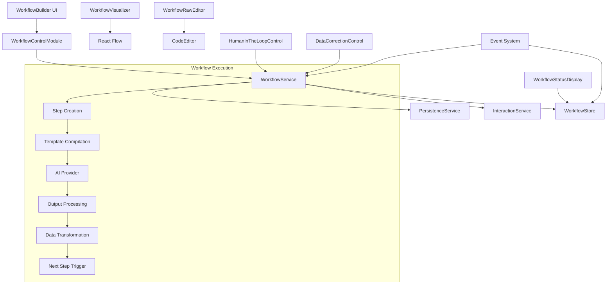
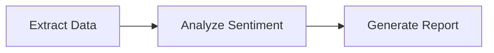
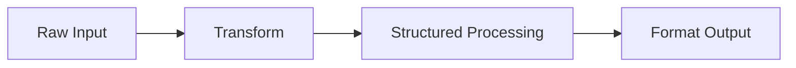
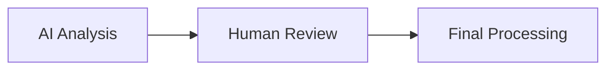
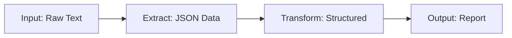

# LiteChat Workflow System

*The comprehensive guide to LiteChat's advanced workflow automation framework*

## Overview

LiteChat's **Workflow System** is a powerful automation framework that transforms LiteChat from a simple chat interface into a sophisticated AI orchestration platform. It enables users to create, manage, and execute complex multi-step AI workflows with dynamic prompt templating, data transformation, and intelligent step orchestration.

### Core Philosophy

The workflow system is built on three fundamental principles:
1. **Privacy-First**: All processing happens client-side, maintaining LiteChat's core privacy commitment
2. **Event-Driven Architecture**: Robust, loosely-coupled components that communicate through events
3. **Visual-First Design**: Complex workflows become understandable through visual representation

### Key Features

- 🏗️ **Visual Workflow Builder**: Intuitive three-tab interface (Builder, Visualizer, Raw Editor)
- 🔄 **React Flow Visualization**: Interactive workflow diagrams with animated connections
- 📝 **Raw JSON Editor**: Direct workflow editing with real-time validation and schema checking
- 💾 **Persistent Workflow Library**: Full CRUD operations with database persistence
- 🎯 **Dynamic Trigger Configuration**: Custom prompts, template-based triggers, or agent tasks
- 🔗 **Multi-Step Orchestration**: Automated execution with intelligent data flow between steps
- 🎨 **Model Selection per Step**: Different AI models for different workflow stages
- 🧩 **Template Integration**: Seamless integration with existing prompt templates and agent tasks
- ⚡ **Real-Time Execution**: Live workflow execution with streaming responses and progress tracking
- 🔄 **Data Transformation**: JSONPath-based data transformation between workflow steps
- 👤 **Human-in-the-Loop**: Manual intervention points for review and correction
- 🛡️ **Error Handling**: Graceful error recovery and workflow state management

## Architecture

### System Components



### Core Modules

#### 1. WorkflowControlModule (`src/controls/modules/WorkflowControlModule.ts`)
The central control module that:
- Manages workflow-related UI components registration
- Handles workflow execution requests and lifecycle
- Integrates with persistence layer and provides data to UI components
- Validates transform queries and provides real-time feedback
- Coordinates with prompt template and agent task systems

#### 2. Workflow Service (`src/services/workflow.service.ts`)
The execution engine that:
- Orchestrates workflow execution from start to completion
- Manages step-by-step processing and data flow
- Handles data transformation using JSONPath queries
- Creates child interactions for each workflow step
- Integrates with AI providers and the interaction system
- Manages workflow runs and state transitions

#### 3. Workflow Builder UI (`src/controls/components/workflow/WorkflowBuilder.tsx`)
The main user interface featuring:
- **Three-tab layout**: Workflows list, Builder interface, and execution controls
- **Responsive design**: Optimized proportions (1/4 trigger config vs 3/4 steps on XL, 1/3 vs 2/3 on LG)
- **Real-time form management**: Independent form state management to prevent re-rendering issues
- **Sub-tab system**: Builder, Visualizer, and Raw Editor tabs for comprehensive workflow management
- **Action controls**: Save, fork, run, and cancel operations with proper state management

#### 4. Workflow Visualization (`src/controls/components/workflow/WorkflowVisualizer.tsx`)
Interactive React Flow integration:
- **Custom Node Components**: Visual representation of different step types with status indicators
- **Animated Connections**: Flow connections with proper visual hierarchy
- **Status Visualization**: Real-time status updates during execution with color-coded states
- **Interactive Exploration**: Zoom, pan, and minimap for complex workflow navigation
- **Read-only Mode**: Safe visualization that doesn't interfere with execution

#### 5. Raw JSON Editor (`src/controls/components/workflow/WorkflowRawEditor.tsx`)
Advanced editing capabilities:
- **Real-time Validation**: Comprehensive schema validation with detailed error reporting
- **Syntax Highlighting**: Code editor with proper JSON formatting
- **Separate Save Logic**: Independent save functionality with database validation
- **Error Prevention**: Debounced validation to prevent input field focus loss

#### 6. Data Persistence (`src/services/persistence.service.ts`)
Database operations:
- **Workflow CRUD**: Create, read, update, delete operations for workflow templates
- **Template Loading**: Fresh template loading to prevent stale data issues
- **Transaction Safety**: Proper error handling and rollback mechanisms
- **Schema Migration**: Future-proof schema design for workflow evolution

### Advanced Features

#### Data Transformation System
The workflow system includes a sophisticated data transformation engine:

**JSONPath Query Engine**:
```typescript
// Transform previous step output to next step input
{
  "customer_name": "$.initial_step.extracted_name",
  "order_details": "$.outputs[1].order_info",
  "total_amount": "$.outputs[2].calculated_total"
}
```

**Static Value Support**:
```typescript
{
  "api_endpoint": "\"https://api.example.com\"",
  "retry_count": "3",
  "use_cache": "true"
}
```

**Context Structure**:
```typescript
interface TransformContext {
  workflow: WorkflowTemplate;     // Original template (immutable)
  initial_step: any;              // Trigger step output
  outputs: any[];                 // Array of previous step outputs
}
```

#### Human-in-the-Loop Integration
**Pause Points**: Workflows can pause at designated steps for human review
**Data Correction**: Manual correction of AI output when structured data parsing fails
**Flexible Resume**: Continue with original or modified data

#### Error Handling and Recovery
**Graceful Degradation**: Workflows continue when possible, pause when necessary
**Error Context**: Detailed error information for debugging and recovery
**State Persistence**: Workflow state is preserved across browser sessions

## Type System

### Core Types

```typescript
export interface WorkflowTemplate {
  id: string;
  name: string;
  description: string;
  steps: WorkflowStep[];
  triggerType?: 'custom' | 'template' | 'task';
  triggerRef?: string;
  triggerPrompt?: string;
  templateVariables?: Record<string, any>;
  createdAt: string;
  updatedAt: string;
}

export interface WorkflowStep {
  id: string;
  name: string;
  type: WorkflowStepType;
  modelId?: string;
  templateId?: string;
  instructionsForHuman?: string;
  transformMappings?: Record<string, string>;
  inputMapping?: Record<string, string>;
  prompt?: string;
  structuredOutput?: {
    schema: Record<string, any>;
    jsonSchema: object;
  };
}

export type WorkflowStepType = 
  | "prompt" 
  | "agent-task" 
  | "human-in-the-loop" 
  | "transform";

export interface WorkflowRun {
  runId: string;
  conversationId: string;
  mainInteractionId: string;
  template: WorkflowTemplate;
  status: WorkflowRunStatus;
  currentStepIndex: number;
  stepOutputs: Record<string, any>;
  error?: string;
  startedAt: string;
  completedAt?: string;
}

export type WorkflowRunStatus = 
  | "IDLE" 
  | "RUNNING" 
  | "PAUSED" 
  | "COMPLETED" 
  | "ERROR" 
  | "STREAMING" 
  | "CANCELLED";
```

### Event System

```typescript
export interface WorkflowEventPayloads {
  [workflowEvent.startRequest]: {
    template: WorkflowTemplate;
    initialPrompt: string;
    conversationId: string;
  };
  [workflowEvent.stepCompleted]: {
    runId: string;
    stepId: string;
    output: any;
  };
  [workflowEvent.paused]: {
    runId: string;
    step: WorkflowStep;
    pauseReason: 'human-in-the-loop' | 'data-correction';
    dataForReview?: any;
    rawAssistantResponse?: string;
  };
  // ... additional event types
}
```

## User Guide

### Creating Your First Workflow

#### Step 1: Open the Workflow Builder
Click the workflow icon (🔄) in the prompt controls to open the Workflow Builder dialog.

#### Step 2: Create a New Workflow
1. Navigate to the "New Workflow" tab (or click "Create New Workflow" from the list)
2. Fill in the basic information:
   - **Name**: Give your workflow a descriptive name
   - **Description**: Explain what this workflow does

#### Step 3: Configure the Trigger
Choose how your workflow starts:

**Custom Prompt**:
```
Analyze the following customer feedback and extract key insights: [USER_INPUT]
```

**Template-Based**:
- Select an existing prompt template
- Configure template variables
- Preview the compiled prompt

**Agent Task**:
- Choose from available agent tasks
- Template variables are automatically configured

#### Step 4: Add Workflow Steps
Click "Add Step" to create subsequent steps:

**AI Prompt Step**:
- Select a model for this step
- Choose a prompt template
- Configure how data flows from previous steps

**Agent Task Step**:
- Select an agent task template
- Configure model and parameters
- Set up input mapping from previous steps

**Transform Step**:
- Map outputs from previous steps to inputs for next step
- Use JSONPath queries: `$.outputs[0].customer_name`
- Support static values: `"API_KEY"`, `42`, `true`

**Human-in-the-Loop Step**:
- Add manual review points
- Provide instructions for human reviewers
- Allow data modification before continuation

#### Step 5: Save and Test
1. Click "Save" to persist your workflow
2. Click "Run Workflow" to test execution
3. Monitor progress in the conversation view

### Advanced Workflow Patterns

#### Sequential Processing


#### Data Transformation Pipeline


#### Human Review Workflow


### Working with the Visualizer

The **Visualizer** tab provides an interactive React Flow diagram:

**Node Types**:
- 🎯 **Initial Step**: Workflow trigger (blue)
- 💬 **Prompt Step**: AI prompt processing (green)
- 🤖 **Agent Task**: Agent-based processing (purple)
- 👤 **Human-in-the-Loop**: Manual intervention (orange)
- ⚙️ **Transform**: Data transformation (gray)

**Status Indicators**:
- ⏳ **Running**: Step currently executing
- ✅ **Success**: Step completed successfully
- ❌ **Error**: Step failed with error
- ⏸️ **Pending**: Step waiting to execute

**Navigation**:
- **Zoom**: Mouse wheel or controls
- **Pan**: Click and drag
- **Fit View**: Auto-fit button
- **Minimap**: Overview in bottom-right

### Raw JSON Editor

The **Raw Editor** provides direct access to workflow JSON:

**Features**:
- **Syntax Highlighting**: JSON formatting with error highlighting
- **Real-time Validation**: Schema validation as you type
- **Error Display**: Detailed error messages with line numbers
- **Save Functionality**: Independent save to database

**Schema Validation**:
- Required fields validation
- Type checking for all properties
- Step configuration validation
- Referential integrity checks

**Example Workflow JSON**:
```json
{
  "id": "workflow-123",
  "name": "Customer Feedback Analysis",
  "description": "Analyzes customer feedback and generates actionable insights",
  "triggerType": "custom",
  "triggerPrompt": "Analyze this customer feedback: [USER_INPUT]",
  "steps": [
    {
      "id": "step-1",
      "name": "Extract Key Points",
      "type": "prompt",
      "modelId": "gpt-4",
      "templateId": "extract-template-id"
    },
    {
      "id": "step-2",
      "name": "Transform Data",
      "type": "transform",
      "transformMappings": {
        "key_points": "$.initial_step.extracted_points",
        "sentiment": "$.initial_step.sentiment_score"
      }
    }
  ],
  "createdAt": "2024-01-01T00:00:00Z",
  "updatedAt": "2024-01-01T00:00:00Z"
}
```

## Development Guide

### Architecture Patterns

#### Event-Driven Communication
```typescript
// Starting a workflow
modApi.emit(workflowEvent.startRequest, {
  template: workflowTemplate,
  initialPrompt: userInput,
  conversationId: currentConversationId
});

// Listening for completion
modApi.on(workflowEvent.completed, (payload) => {
  console.log(`Workflow ${payload.runId} completed`);
});
```

#### State Management
```typescript
// Workflow store for execution state
const { activeRun, pausePayload } = useWorkflowStore();

// Control module for UI data
const workflows = module.getWorkflows();
const templates = module.getPromptTemplates();
```

#### Service Integration
```typescript
// Database operations
await PersistenceService.saveWorkflow(workflow);
const workflows = await PersistenceService.loadWorkflows();

// Template compilation
const compiled = await module.compileTemplate(templateId, variables);
```

### Adding New Step Types

#### 1. Extend Type Definitions
```typescript
// In src/types/litechat/workflow.ts
export type WorkflowStepType = 
  | "prompt" 
  | "agent-task" 
  | "human-in-the-loop" 
  | "transform"
  | "your-new-type";

export interface WorkflowStep {
  // ... existing fields
  yourNewTypeConfig?: YourConfigInterface;
}
```

#### 2. Update UI Components
```typescript
// In WorkflowStepCard.tsx
{step.type === 'your-new-type' && (
  <div className="space-y-1">
    <Label>Your Custom Configuration</Label>
    <YourCustomConfigComponent
      value={step.yourNewTypeConfig}
      onChange={(config) => onChange({ ...step, yourNewTypeConfig: config })}
    />
  </div>
)}
```

#### 3. Implement Execution Logic
```typescript
// In WorkflowService.ts
case 'your-new-type':
  return await WorkflowService._executeYourNewStepType(run, step, stepIndex);
```

#### 4. Add Visualization Support
```typescript
// In WorkflowVisualizer.tsx
case 'your-new-type':
  return '🔧'; // Your custom icon
```

### Custom Validation Logic

#### Transform Query Validation
```typescript
// Extend WorkflowControlModule.validateTransformQuery
validateTransformQuery(query: string, workflow?: WorkflowTemplate, stepIndex?: number): ValidationResult {
  // Your custom validation logic
  if (query.includes('dangerous_operation')) {
    return { isValid: false, error: 'Dangerous operation not allowed' };
  }
  
  return { isValid: true };
}
```

#### Template Integration
```typescript
// Add new template types to control module
async loadCustomTemplates(): Promise<CustomTemplate[]> {
  // Load your custom templates
}

getCustomTemplates(): CustomTemplate[] {
  return this.customTemplates;
}
```

### Testing Workflows

#### Unit Testing Example
```typescript
describe('WorkflowService', () => {
  it('should execute transform step correctly', async () => {
    const run = createMockWorkflowRun();
    const step = createMockTransformStep();
    
    const result = await WorkflowService._executeTransformStep(run, step, 0);
    
    expect(result).toMatchObject({
      transformedField: 'expected_value'
    });
  });
});
```

#### Integration Testing
```typescript
describe('Workflow Execution', () => {
  it('should complete end-to-end workflow', async () => {
    const template = createTestWorkflow();
    
    // Start workflow
    await triggerWorkflow(template, 'test input');
    
    // Wait for completion
    await waitForWorkflowCompletion();
    
    // Verify results
    expect(getWorkflowOutput()).toMatchSnapshot();
  });
});
```

## Best Practices

### Workflow Design

#### 1. Single Responsibility Principle
Each step should have one clear purpose:
```
❌ "Analyze and format and send data"
✅ "Analyze customer sentiment"
✅ "Format analysis report"
✅ "Send notification"
```

#### 2. Error Handling Strategy
Design workflows with failure scenarios in mind:
- Use human-in-the-loop steps for critical decisions
- Implement transform steps for data validation
- Provide clear error messages and recovery paths

#### 3. Data Flow Design
Plan how data flows between steps:


#### 4. Progressive Complexity
Start simple and add complexity gradually:
1. Begin with 2-3 steps
2. Test thoroughly at each stage
3. Add advanced features like transforms and human review
4. Optimize for performance and user experience

### Performance Optimization

#### 1. Model Selection
Choose appropriate models for each step's complexity:
- **Simple tasks**: Use faster, smaller models
- **Complex analysis**: Use larger, more capable models
- **Transform steps**: No model needed (client-side processing)

#### 2. Template Caching
Leverage template compilation caching:
```typescript
// Templates are cached after first compilation
const compiled = await module.compileTemplate(templateId, variables);
```

#### 3. Batch Operations
Group related operations when possible:
```typescript
// Good: Transform multiple fields at once
{
  "name": "$.customer.name",
  "email": "$.customer.email",
  "phone": "$.customer.phone"
}

// Less efficient: Multiple transform steps
```

### User Experience Guidelines

#### 1. Clear Naming Conventions
- **Workflows**: Descriptive action names ("Customer Feedback Analysis")
- **Steps**: Clear action verbs ("Extract Key Points", "Generate Summary")
- **Variables**: Semantic names ("customer_name", not "var1")

#### 2. Helpful Descriptions
Provide context for users:
```typescript
{
  name: "Sentiment Analysis",
  description: "Analyzes customer feedback sentiment using advanced NLP techniques and provides confidence scores"
}
```

#### 3. Progressive Disclosure
Start with essential information, provide details on demand:
- Basic workflow info always visible
- Advanced configuration in expandable sections
- Expert features in separate tabs

## Troubleshooting

### Common Issues

#### Workflow Won't Start
**Symptoms**: Workflow button is disabled or nothing happens when clicked
**Solutions**:
1. Ensure a conversation is active
2. Check that required models are available
3. Verify trigger configuration is complete
4. Check browser console for errors

#### Steps Not Executing
**Symptoms**: Workflow starts but stops at a specific step
**Solutions**:
1. Verify step configuration and template selection
2. Check model availability and permissions
3. Review input mapping configuration
4. Validate transform queries if using transform steps

#### Data Not Flowing Between Steps
**Symptoms**: Steps execute but don't receive expected data
**Solutions**:
1. Check JSONPath queries in transform steps
2. Verify structured output configuration
3. Review step output formats
4. Use the visualizer to debug data flow

#### Form Focus Issues
**Symptoms**: Input fields lose focus while typing
**Solutions**:
1. Avoid rapid tab switching while editing
2. Save work frequently
3. Use the raw editor for complex edits
4. Report specific scenarios for bug fixes

### Debug Information

#### Workflow Execution Logging
Enable detailed logging in browser console:
```javascript
// Set localStorage flag for verbose workflow logging
localStorage.setItem('workflow:debug', 'true');
```

#### State Inspection
Use browser dev tools to inspect workflow state:
```javascript
// In console
window.__LITECHAT_STORES__.workflow.getState();
window.__LITECHAT_STORES__.interaction.getState();
```

#### Template Validation
Test template compilation separately:
```javascript
// In console
await window.__LITECHAT_MODULES__.workflow.compileTemplate(templateId, testData);
```

## API Reference

### WorkflowControlModule

#### Methods

**`getWorkflows(): WorkflowTemplate[]`**
Returns all saved workflow templates

**`getPromptTemplates(): PromptTemplate[]`**
Returns available prompt templates for workflow steps

**`getAgentTasks(): (PromptTemplate & { prefixedName: string })[]`**
Returns available agent tasks with prefixed names

**`getModels(): ModelListItem[]`**
Returns globally enabled AI models

**`compileTemplate(templateId: string, formData: Record<string, any>): Promise<CompiledPrompt>`**
Compiles a template with provided variables

**`validateTransformQuery(query: string, workflow?: WorkflowTemplate, stepIndex?: number): ValidationResult`**
Validates JSONPath queries for transform steps

**`startWorkflow(template: WorkflowTemplate, initialPrompt: string): void`**
Starts workflow execution

**`refreshWorkflows(): Promise<void>`**
Reloads workflows from database

### WorkflowService

#### Static Methods

**`initialize(): void`**
Initializes the workflow service and event listeners

**`handleWorkflowStartRequest(payload): Promise<void>`**
Processes workflow start requests

**`_executeTransformStep(run, step, stepIndex): Promise<any>`**
Executes data transformation logic

**`_resolveJsonPath(obj: any, path: string): any`**
Resolves JSONPath queries against data objects

**`_buildTransformContext(run, stepIndex): Record<string, any>`**
Builds context object for transform steps

### PersistenceService

#### Workflow Methods

**`saveWorkflow(workflow: WorkflowTemplate): Promise<void>`**
Saves workflow to database

**`loadWorkflows(): Promise<WorkflowTemplate[]>`**
Loads all workflows from database

**`deleteWorkflow(workflowId: string): Promise<void>`**
Deletes workflow from database

**`loadPromptTemplateById(templateId: string): Promise<PromptTemplate | null>`**
Loads fresh template data by ID

## Security Considerations

### Data Privacy
- All workflow processing happens client-side
- No workflow data is sent to external services
- User data remains in local browser storage

### Input Validation
- JSONPath queries are sanitized to prevent injection
- Template variables are validated before compilation
- File operations include security checks

### Access Control
- Workflows are scoped to individual users
- No cross-user data access
- Template permissions are respected

## Future Roadmap

### Short-term Enhancements (v1.1)
- **Conditional Logic**: If/then branching in workflows
- **Loop Support**: Iteration and repeat logic
- **Parallel Execution**: Concurrent step processing
- **Enhanced Error Recovery**: Better failure handling

### Medium-term Features (v1.2)
- **Workflow Templates**: Pre-built workflow library
- **Import/Export**: Workflow sharing and backup
- **Advanced Transforms**: Complex data manipulation functions
- **Performance Monitoring**: Execution time and resource tracking

### Long-term Vision (v2.0)
- **Collaborative Workflows**: Multi-user workflow development
- **API Integration**: External service connections
- **Workflow Marketplace**: Community workflow sharing
- **AI-Assisted Building**: Intelligent workflow generation

## Contributing

### Development Setup
1. Clone the repository
2. Install dependencies: `npm install`
3. Start development server: `npm run dev`
4. Open workflow builder and test changes

### Code Style Guidelines
- Follow existing TypeScript patterns
- Use meaningful variable and function names
- Add comprehensive error handling
- Include JSDoc comments for public APIs
- Write tests for new functionality

### Submitting Changes
1. Create feature branch: `git checkout -b feature/workflow-enhancement`
2. Make changes and test thoroughly
3. Add or update tests as needed
4. Update documentation
5. Submit pull request with detailed description

---

*This documentation is continuously updated to reflect the latest workflow system capabilities and best practices. For questions or improvements, please refer to the project's issue tracker or development team.* 